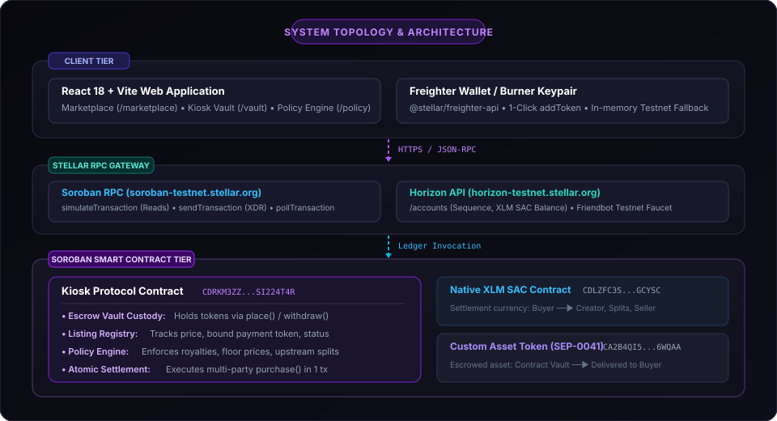
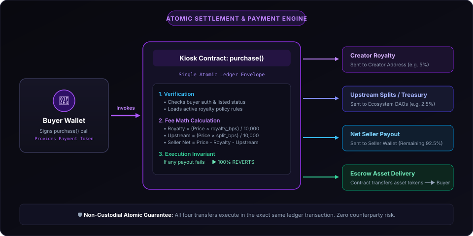
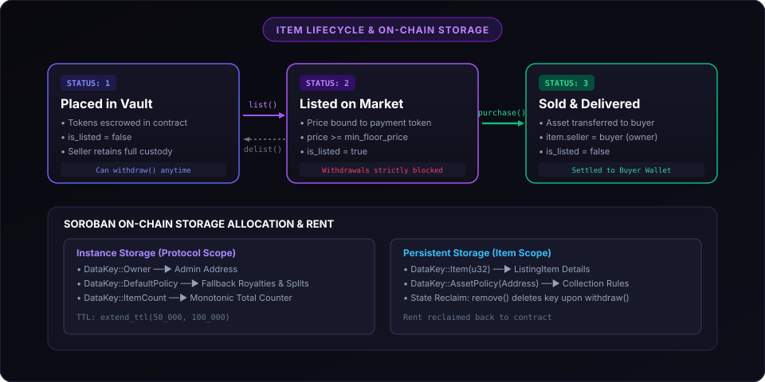

# StellarKiosk

> **Autonomous Digital Asset Escrow, Programmatic Transfer Policy Engine & Atomic Settlement Protocol on Stellar (Soroban)**  
> A decentralized, non-custodial protocol enforcing creator royalties, multi-party upstream revenue splits, floor prices, and trustless escrow settlement natively on the Stellar blockchain.

[](https://opensource.org/licenses/MIT)
[](https://stellar.expert/explorer/testnet)
[](https://soroban.stellar.org)
[](.github/workflows/ci.yml)
[](.github/workflows/ci.yml)

---

## Table of Contents

1. [Protocol Overview](#1-protocol-overview)
2. [Live On-Chain Deployments](#2-live-on-chain-deployments)
3. [Comprehensive System Architecture](#3-comprehensive-system-architecture)
   - [3.1 System Topology & Tier Organization](#31-system-topology--tier-organization)
   - [3.2 Atomic Settlement & Payment Engine](#32-atomic-settlement--payment-engine)
   - [3.3 Item Lifecycle & State Machine](#33-item-lifecycle--state-machine)
   - [3.4 Soroban State & Storage Architecture](#34-soroban-state--storage-architecture)
4. [Smart Contract Technical Reference (`contracts/kiosk`)](#4-smart-contract-technical-reference-contractskiosk)
   - [4.1 Entry Point Interface Signatures](#41-entry-point-interface-signatures)
   - [4.2 Entry Point Specifications](#42-entry-point-specifications)
   - [4.3 Data Structures & Type Definitions](#43-data-structures--type-definitions)
   - [4.4 Error Codes & Invariant Reversions (`KioskError`)](#44-error-codes--invariant-reversions-kioskerror)
   - [4.5 Emitted Contract Events](#45-emitted-contract-events)
5. [Token Standards & Custody Mechanics](#5-token-standards--custody-mechanics)
   - [5.1 Stellar Asset Contract (SAC)](#51-stellar-asset-contract-sac)
   - [5.2 SEP-0041 Fungible & Semi-Fungible Tokens](#52-sep-0041-fungible--semi-fungible-tokens)
   - [5.3 Direct Contract Custody & Escrow Delivery](#53-direct-contract-custody--escrow-delivery)
6. [Frontend Architecture & Dual-Wallet Infrastructure](#6-frontend-architecture--dual-wallet-infrastructure)
   - [6.1 Dual-Wallet Adapter Architecture](#61-dual-wallet-adapter-architecture)
   - [6.2 1-Click Freighter Asset Tracker Integration](#62-1-click-freighter-asset-tracker-integration)
   - [6.3 Real-Time On-Chain Balance Scanner](#63-real-time-on-chain-balance-scanner)
   - [6.4 RPC Simulation & Transaction Lifecycle](#64-rpc-simulation--transaction-lifecycle)
7. [Repository File Structure](#7-repository-file-structure)
8. [Automated Verification & Test Matrix](#8-automated-verification--test-matrix)
   - [8.1 Kiosk Protocol Test Suite (17 Tests)](#81-kiosk-protocol-test-suite-17-tests)
   - [8.2 Asset Token Test Suite (4 Tests)](#82-asset-token-test-suite-4-tests)
   - [8.3 Static Analysis & Linting](#83-static-analysis--linting)
9. [Developer Quickstart & Local Setup](#9-developer-quickstart--local-setup)
   - [9.1 Prerequisites](#91-prerequisites)
   - [9.2 Installation & Local Dev Server](#92-installation--local-dev-server)
   - [9.3 WebAssembly Compilation](#93-webassembly-compilation)
10. [Stellar CLI Command Reference (Testnet Cheatsheet)](#10-stellar-cli-command-reference-testnet-cheatsheet)
11. [Formal Protocol Invariants & Security Guarantees](#11-formal-protocol-invariants--security-guarantees)
12. [License](#12-license)

---

## 1. Protocol Overview

**StellarKiosk** is a decentralized digital asset escrow protocol, transfer policy engine, and atomic marketplace implemented natively on the **Stellar network** using **Soroban smart contracts** (Rust) and an enterprise **React + TypeScript** web interface.

### The Problem
In conventional marketplace models, secondary digital asset sales suffer from significant structural limitations:
1. **Voluntary Royalty Enforcement:** Creator royalties are typically maintained by off-chain marketplace databases. If an asset is traded via an OTC transaction, alternative marketplace, or direct wrapper contract, creator compensation is completely bypassed.
2. **Fragmented Revenue Distributions:** Splitting revenue across multiple entities (e.g., development teams, DAO treasuries, platform operators, and original creators) requires complex multi-transaction workflows or intermediary custodial escrow contracts, introducing failure points and non-atomic execution risks.
3. **Custodial Counterparty Risk:** Traditional platforms hold seller assets in custodial wallets or centralized contracts lacking formal guarantees on asset reclaimability, price floors, and deterministic delisting.

### The StellarKiosk Solution
StellarKiosk solves these challenges at the consensus layer of the Stellar ledger:
* **Autonomous Non-Custodial Vault:** Sellers deposit assets directly into the `KioskContract`. While locked in contract custody, the seller retains cryptographic ownership authority and can withdraw unlisted items at any time.
* **On-Chain Policy Engine:** Collections and creators define immutable transfer policies containing basis-point creator royalties, multi-recipient upstream revenue splits, and minimum floor prices. Collection policies override protocol-level defaults.
* **Single-Envelope Atomic Settlement:** Purchases are executed within a single ledger transaction envelope. The smart contract simultaneously routes royalties, upstream splits, and net seller payouts in the listing's bound payment token, while delivering the escrowed asset to the buyer. If any payment leg fails, the entire transaction reverts.
* **Zero-Backend Architecture:** The client communicates directly with public Stellar RPC nodes (Soroban RPC and Horizon API). No off-chain databases, indexing servers, or private API keys are required.

---

## 2. Live On-Chain Deployments

All protocol contracts are compiled to WebAssembly (`wasm32-unknown-unknown`), deployed, initialized, and operational on the **Stellar Testnet** (`Passphrase: Test SDF Network ; September 2015`):

| Contract / Account | Role | Address | Explorer Verification |
| :--- | :--- | :--- | :--- |
| **Kiosk Protocol** | Core Escrow & Marketplace | `CDRKM3ZZXKJQ7VHCQUBO3BZWS3NDPWHSVSNDXX54ZFWEW3AMSI224T4R` | [StellarExpert Contract](https://stellar.expert/explorer/testnet/contract/CDRKM3ZZXKJQ7VHCQUBO3BZWS3NDPWHSVSNDXX54ZFWEW3AMSI224T4R) |
| **Asset Token (SEP-0041)** | Reference Custom Asset (Axon License) | `CA2B4QI5LZW63D2WFQIDADASCKPAWU3W75H7RZZQIXT244PK7636WQAA` | [StellarExpert Contract](https://stellar.expert/explorer/testnet/contract/CA2B4QI5LZW63D2WFQIDADASCKPAWU3W75H7RZZQIXT244PK7636WQAA) |
| **Native XLM SAC** | Settlement Currency Wrapper | `CDLZFC3SYJYDZT7K67VZ75HPJVIEUVNIXF47ZG2FB2RMQQVU2HHGCYSC` | [StellarExpert Contract](https://stellar.expert/explorer/testnet/contract/CDLZFC3SYJYDZT7K67VZ75HPJVIEUVNIXF47ZG2FB2RMQQVU2HHGCYSC) |
| **Protocol Admin** | Deployer & Governance Owner | `GBOLOWBCVE2AZ3XTFKQURYTSLZHTXA2IM7JSKIYOJB37XVTDPJTAEB5X` | [StellarExpert Account](https://stellar.expert/explorer/testnet/account/GBOLOWBCVE2AZ3XTFKQURYTSLZHTXA2IM7JSKIYOJB37XVTDPJTAEB5X) |
| **Protocol Treasury** | Upstream Split Recipient | `GD54GYI3SRVER7O56DLEXZEXQ2UJVXIOOXZYVV5ITCZ4MOEJ3XFLXNVO` | [StellarExpert Account](https://stellar.expert/explorer/testnet/account/GD54GYI3SRVER7O56DLEXZEXQ2UJVXIOOXZYVV5ITCZ4MOEJ3XFLXNVO) |
| **Contract WASM Hash** | Compiled Binary Identifier | `9cb249d2d00ab4fa84af0dc096a7504988d00b0649fa142bd82cd84e91f29e52` | — |

---

## 3. Comprehensive System Architecture

The StellarKiosk protocol is organized across three integrated tiers: Client Presentation, RPC Gateway, and Soroban On-Chain Execution.

### 3.1 System Topology & Tier Organization



```
┌─────────────────────────────────────────────────────────────────────────────────┐
│                                   CLIENT TIER                                   │
│  React 18 + Vite SPA  │  Tailwind CSS  │  Dual-Wallet Adapter                   │
│  ├─ Primary Signer: Freighter Extension (@stellar/freighter-api)                │
│  └─ Fallback Signer: In-Session Ephemeral Keypair (sessionStorage)              │
└──────────────────────────────────────┬──────────────────────────────────────────┘
                                       │ HTTPS / JSON-RPC / REST
                                       ▼
┌─────────────────────────────────────────────────────────────────────────────────┐
│                            NETWORK & GATEWAY TIER                               │
│  Soroban RPC (soroban-testnet.stellar.org)                                      │
│  ├─ simulateTransaction (dry-run footprint & auth inspection)                   │
│  ├─ sendTransaction (broadcast signed transaction envelope)                     │
│  └─ getTransaction (poll ledger finality & decode transactionMeta)              │
│  Horizon API (horizon-testnet.stellar.org): Account balances & sequence numbers │
│  Friendbot API (friendbot.stellar.org): Automated 10,000 XLM testnet faucet     │
└──────────────────────────────────────┬──────────────────────────────────────────┘
                                       │ Stellar Consensus Protocol (SCP)
                                       ▼
┌─────────────────────────────────────────────────────────────────────────────────┐
│                         SOROBAN ON-CHAIN EXECUTION TIER                         │
│  Kiosk Protocol Contract (CDRKM3ZZXKJQ7VHCQUBO3BZWS3NDPWHSVSNDXX54ZFWEW3AMSI224T4R)│
│  ├─ State Storage: Instance (Owner, DefaultPolicy) & Persistent (Item, Policy)  │
│  ├─ Cross-Contract Invocations: soroban_sdk::token::Client                      │
│  │   ├─ Payment Token Leg: Native XLM SAC (CDLZFC3S...) or Custom Token         │
│  │   └─ Asset Escrow Leg: SEP-0041 Asset Token (CA2B4QI5...)                    │
│  └─ Event Stream: (Symbol("KIOSK"), EventTopic)                                │
└─────────────────────────────────────────────────────────────────────────────────┘
```

1. **Client Tier:**
   * Single-page application built on **React 18**, **TypeScript**, **Vite**, and **Tailwind CSS**.
   * State management encapsulates connected wallet state, active listings catalog, user vault inventory, and policy engine settings.
   * Direct hardware/extension signing via `@stellar/freighter-api` with automatic fallback to client-generated ephemeral keypairs for immediate onboarding.
2. **Network & RPC Gateway Tier:**
   * **Soroban RPC (`https://soroban-testnet.stellar.org`):** Executes transaction simulations to generate ledger footprints (read/write access lists and storage rent keys), submits signed transaction envelopes, and queries transaction inclusion status.
   * **Horizon API (`https://horizon-testnet.stellar.org`):** Queries account sequence numbers, sub-entry counts, and classic trustline balances.
   * **Friendbot (`https://friendbot.stellar.org`):** Fulfills automated account creation and 10,000 testnet XLM funding requests.
3. **Smart Contract Execution Tier:**
   * Runs in the WebAssembly execution environment of Soroban on Stellar validators.
   * Cross-contract calls utilize the official `soroban_sdk::token::Client` interface for standards-compliant token transfers.
   * Emits structured topics and payloads indexed by Soroban RPC event ingestion subsystems.

---

### 3.2 Atomic Settlement & Payment Engine



When a buyer triggers `purchase(buyer, item_id)`, the transaction is executed as an **indivisible multi-party payment settlement**:

#### Settlement Fee Distribution Breakdown

Fee allocations are configured using **basis points (BPS)**, where `100 BPS = 1.00%` and `10,000 BPS = 100.00%`. During `purchase()`, the contract automatically calculates and routes each payment leg directly from the buyer's account:

| Payment Leg | Configuration Source | Calculation Rule | Designated Recipient | Example (100 XLM Sale) |
| :--- | :--- | :--- | :--- | :--- |
| **Creator Royalty** | `policy.royalty_bps` (e.g. 500 = 5%) | `(price * royalty_bps) / 10,000` | Collection Creator / Designated Address | **5.00 XLM** |
| **Upstream Split #1** | `split[0].share_bps` (e.g. 250 = 2.5%) | `(price * share_bps) / 10,000` | Protocol Treasury / DAO Account | **2.50 XLM** |
| **Upstream Split #2** | `split[1].share_bps` (e.g. 100 = 1%) | `(price * share_bps) / 10,000` | Referral Partner / Platform Affiliate | **1.00 XLM** |
| **Seller Net Payout** | Remaining Balance | `price - royalty - total_splits` | Listing Seller | **91.50 XLM** |

* **Basis Point Safety Cap:** Total deductions (`royalty_bps + sum(share_bps)`) cannot exceed `10,000 BPS` (100%). Any policy exceeding this is rejected with `KioskError::InvalidBps (7)`.
* **Zero-Leakage Guarantee:** The contract uses native integer division truncation. The net seller payout is calculated by subtracting total distributed fees from the gross price, ensuring 100% of the buyer's payment is distributed with zero stranded tokens.

#### Step-by-Step Execution Sequence

1. **Cryptographic Authentication:**
   * Soroban host invokes `buyer.require_auth()`, ensuring the caller holds the private key matching the `buyer` address.
2. **Pre-condition & Invariant Checks:**
   * Loads `ListingItem` from persistent storage key `DataKey::Item(item_id)`. Reverts with `KioskError::ItemNotFound (4)` if not found.
   * Verifies `item.status == ItemStatus::Listed` and `item.is_listed == true`. Reverts with `KioskError::ItemNotListed (5)` if unlisted or already sold.
3. **Policy Resolution Hierarchy:**
   * Checks persistent storage for collection-specific policy override: `DataKey::AssetPolicy(item.asset_contract)`.
   * If not set, retrieves instance fallback policy: `DataKey::DefaultPolicy`.
   * Asserts `item.price >= policy.min_floor_price`.
4. **Multi-Party Payment Leg:**
   * Initializes `token::Client::new(&env, &item.payment_token)`.
   * **Upstream Splits:** Iterates through `policy.upstream_splits`. For each split where `amount > 0`, executes `payment_client.transfer(&buyer, &split.recipient, &amount)`.
   * **Creator Royalty:** If `royalty_amount > 0`, executes `payment_client.transfer(&buyer, &policy.royalty_recipient, &royalty_amount)`.
   * **Seller Payout:** If `seller_amount > 0`, executes `payment_client.transfer(&buyer, &item.seller, &seller_amount)`.
5. **Asset Custody Delivery Leg:**
   * Initializes `token::Client::new(&env, &item.asset_contract)`.
   * Transfers escrowed tokens directly from the Kiosk contract address to the buyer:  
     `asset_client.transfer(&env.current_contract_address(), &buyer, &item.asset_amount)`.
6. **State Mutation & Ownership Transition:**
   * Mutates item record: `item.is_listed = false`, `item.status = ItemStatus::Sold`, `item.seller = buyer` (records new owner).
   * Writes updated `ListingItem` back to `DataKey::Item(item_id)` in persistent storage.
7. **Event Emission:**
   * Publishes contract event: `(Symbol("KIOSK"), Symbol("bought"))` with payload `(item_id, buyer, item.price)`.
8. **Rollback Guarantee:**
   * If any step fails (e.g., buyer has insufficient payment tokens, payment token contract reverts, asset token transfer fails), the entire transaction aborts. All state changes and balance transfers are reverted.

---

### 3.3 Item Lifecycle & State Machine



Every item registered in the Kiosk operates under a strict finite state machine:

```
                            ┌────────────────────────┐
                            │   Seller Wallet Holds  │
                            │    Asset Token SEP-41  │
                            └───────────┬────────────┘
                                        │
                                        │ place() / place_and_list()
                                        ▼
                            ┌────────────────────────┐
                 ┌─────────►│   ItemStatus::Placed   │◄─────────┐
                 │          │   (In Escrow Vault)    │          │
                 │          └───────────┬────────────┘          │
                 │                      │                       │
        delist() │                      │ list()       delist() │
                 │                      ▼                       │
                 │          ┌────────────────────────┐          │
                 └──────────┤   ItemStatus::Listed   ├──────────┘
                            │    (Public Catalog)    │
                            └───────────┬────────────┘
                                        │
                                        │ purchase()
                                        ▼
                            ┌────────────────────────┐
                            │    ItemStatus::Sold    │
                            │  (Delivered to Buyer)  │
                            └────────────────────────┘
```

#### State Transition Matrix

| Current State | Target State | Trigger Function | Required Caller Auth | Invariants Checked | Post-Conditions |
| :--- | :--- | :--- | :--- | :--- | :--- |
| **None** | `Placed` | `place(...)` | `seller` | `asset_amount > 0` | Asset transferred into contract custody; `ItemCount += 1`; `status = Placed`; `is_listed = false`. |
| **None** | `Listed` | `place_and_list(...)` | `seller` | `asset_amount > 0`, `price >= min_floor_price`, `price > 0` | Asset deposited into custody; listed atomically with price and payment token; `status = Listed`; `is_listed = true`. |
| **Placed** | `Listed` | `list(...)` | `seller` | `caller == seller`, `status == Placed`, `price >= min_floor_price`, `price > 0` | Price and payment token set; `status = Listed`; `is_listed = true`. |
| **Listed** | `Placed` | `delist(...)` | `caller` (`seller`) | `caller == seller`, `status == Listed` | Listing deactivated; `status = Placed`; `is_listed = false`; asset remains safely in contract vault. |
| **Listed** | `Listed` | `update_price(...)` | `caller` (`seller`) | `caller == seller`, `status == Listed`, `new_price >= min_floor_price`, `new_price > 0` | Price updated; `status` remains `Listed`; `is_listed` remains `true`. |
| **Placed** | **Reclaimed** | `withdraw(...)` | `caller` (`seller`) | `caller == seller`, `status == Placed` | Escrowed asset transferred back to seller; persistent storage `DataKey::Item(id)` removed via `persistent().remove()`. |
| **Listed** | `Sold` | `purchase(...)` | `buyer` | `buyer != contract`, `status == Listed`, `is_listed == true`, buyer has sufficient payment balance | Royalties, splits, and seller payouts transferred; asset delivered to buyer; `status = Sold`; `is_listed = false`; `seller = buyer`. |

#### Guardrail Invariants
* **Withdrawal Lockout:** Calling `withdraw()` on a listing in `ItemStatus::Listed` immediately reverts with `KioskError::CannotWithdrawListed (11)`. The seller must explicitly `delist()` first, preventing front-running a pending buyer purchase.
* **Terminal Sold State:** Calling `withdraw()` on an item in `ItemStatus::Sold` reverts with `KioskError::ItemAlreadySold (12)`. Calling `purchase()` on an already sold item reverts with `KioskError::ItemNotListed (5)`.

---

### 3.4 Soroban State & Storage Architecture

The protocol utilizes Soroban's multi-tiered storage model to balance ledger footprint, execution costs, and rent preservation:

| Storage Tier | Data Key Enum | Key Schema | Stored Type | TTL Rent Management Policy |
| :--- | :--- | :--- | :--- | :--- |
| **Instance Storage** | `DataKey::Owner` | `Symbol("Owner")` | `Address` | Protocol governance owner. Extended on write via `extend_ttl(50_000, 100_000)`. |
| **Instance Storage** | `DataKey::DefaultPolicy` | `Symbol("DefaultPolicy")` | `TransferPolicy` | Protocol-wide fallback policy. Extended on write via `extend_ttl(50_000, 100_000)`. |
| **Instance Storage** | `DataKey::ItemCount` | `Symbol("ItemCount")` | `u32` | Monotonic global listing counter. Extended on each `place()` via `extend_ttl(50_000, 100_000)`. |
| **Persistent Storage** | `DataKey::Item(u32)` | `(Symbol("Item"), id: u32)` | `ListingItem` | Per-listing metadata, escrow balances, and state. Extended on create/update: `extend_ttl(50_000, 100_000)`. **Reclaimed on `withdraw()` via `persistent().remove()` to eliminate rent drag.** |
| **Persistent Storage** | `DataKey::AssetPolicy(Address)` | `(Symbol("AssetPolicy"), Address)` | `TransferPolicy` | Collection-specific transfer policy override. Extended on configuration: `extend_ttl(50_000, 100_000)`. |

* **TTL Rent Thresholds:** Threshold is set to `50,000` ledgers (~2.9 days at 5s/ledger) with extension to `100,000` ledgers (~5.8 days).
* **Storage Reclamation:** When an unlisted item is withdrawn by its seller, the contract invokes `env.storage().persistent().remove(&DataKey::Item(item_id))`. This permanently purges the key from the ledger state, returning unspent rent reserves and preventing state bloat.

---

## 4. Smart Contract Technical Reference (`contracts/kiosk`)

### 4.1 Entry Point Interface Signatures

```rust
#[contractimpl]
impl KioskContract {
    pub fn initialize(
        env: Env,
        owner: Address,
        royalty_bps: u32,
        royalty_recipient: Address,
        min_floor_price: i128,
        upstream_splits: Vec<UpstreamSplit>,
    ) -> Result<(), KioskError>;

    pub fn set_policy(
        env: Env,
        caller: Address,
        royalty_bps: u32,
        royalty_recipient: Address,
        min_floor_price: i128,
        upstream_splits: Vec<UpstreamSplit>,
    ) -> Result<(), KioskError>;

    pub fn set_asset_policy(
        env: Env,
        creator: Address,
        asset_contract: Address,
        royalty_bps: u32,
        royalty_recipient: Address,
        min_floor_price: i128,
        upstream_splits: Vec<UpstreamSplit>,
    ) -> Result<(), KioskError>;

    pub fn place(
        env: Env,
        seller: Address,
        asset_contract: Address,
        asset_amount: i128,
        title: String,
        description: String,
        asset_type: String,
    ) -> Result<u32, KioskError>;

    pub fn list(
        env: Env,
        seller: Address,
        item_id: u32,
        price: i128,
        payment_token: Address,
    ) -> Result<(), KioskError>;

    pub fn place_and_list(
        env: Env,
        seller: Address,
        asset_contract: Address,
        asset_amount: i128,
        payment_token: Address,
        price: i128,
        title: String,
        description: String,
        asset_type: String,
    ) -> Result<u32, KioskError>;

    pub fn delist(env: Env, caller: Address, item_id: u32) -> Result<(), KioskError>;

    pub fn update_price(env: Env, caller: Address, item_id: u32, new_price: i128) -> Result<(), KioskError>;

    pub fn withdraw(env: Env, caller: Address, item_id: u32) -> Result<(), KioskError>;

    pub fn purchase(env: Env, buyer: Address, item_id: u32) -> Result<(), KioskError>;

    pub fn get_default_policy(env: Env) -> Result<TransferPolicy, KioskError>;

    pub fn get_asset_policy(env: Env, asset_contract: Address) -> Result<TransferPolicy, KioskError>;

    pub fn get_policy(env: Env, asset_contract: Option<Address>) -> Result<TransferPolicy, KioskError>;

    pub fn get_item(env: Env, item_id: u32) -> Result<ListingItem, KioskError>;

    pub fn get_item_count(env: Env) -> u32;

    pub fn get_owner(env: Env) -> Result<Address, KioskError>;
}
```

---

### 4.2 Entry Point Specifications

#### `initialize`
* **Signature:** `initialize(env: Env, owner: Address, royalty_bps: u32, royalty_recipient: Address, min_floor_price: i128, upstream_splits: Vec<UpstreamSplit>) -> Result<(), KioskError>`
* **Authorization:** `owner.require_auth()`
* **Behavior:** One-time configuration of the protocol owner, default royalty policy, and upstream revenue splits. Reverts with `AlreadyInitialized (1)` if `DataKey::Owner` exists. Validates that `royalty_bps + sum(share_bps) <= 10,000`.

#### `set_policy`
* **Signature:** `set_policy(env: Env, caller: Address, royalty_bps: u32, royalty_recipient: Address, min_floor_price: i128, upstream_splits: Vec<UpstreamSplit>) -> Result<(), KioskError>`
* **Authorization:** `caller.require_auth()`
* **Behavior:** Updates protocol-wide fallback transfer policy. Validates `caller == owner`; reverts with `Unauthorized (3)` otherwise. Validates basis points (`<= 10,000`).

#### `set_asset_policy`
* **Signature:** `set_asset_policy(env: Env, creator: Address, asset_contract: Address, royalty_bps: u32, royalty_recipient: Address, min_floor_price: i128, upstream_splits: Vec<UpstreamSplit>) -> Result<(), KioskError>`
* **Authorization:** `creator.require_auth()`
* **Behavior:** Sets a collection-specific transfer policy stored under `DataKey::AssetPolicy(asset_contract)`. Overrides default policy for items using this asset contract. Validates basis points (`<= 10,000`).

#### `place`
* **Signature:** `place(env: Env, seller: Address, asset_contract: Address, asset_amount: i128, title: String, description: String, asset_type: String) -> Result<u32, KioskError>`
* **Authorization:** `seller.require_auth()`
* **Behavior:** Enforces `asset_amount > 0`. Transfers `asset_amount` from `seller` to the contract address via `token::Client::transfer()`. Increments `ItemCount`, constructs `ListingItem` with `ItemStatus::Placed`, writes to persistent storage, extends TTL, and returns the new `item_id`.

#### `list`
* **Signature:** `list(env: Env, seller: Address, item_id: u32, price: i128, payment_token: Address) -> Result<(), KioskError>`
* **Authorization:** `seller.require_auth()`
* **Behavior:** Retrieves item by `item_id`. Enforces `item.seller == seller`, `item.status == ItemStatus::Placed`, `price > 0`, and `price >= effective_policy.min_floor_price`. Sets `item.price`, `item.payment_token`, `item.is_listed = true`, and `item.status = ItemStatus::Listed`.

#### `place_and_list`
* **Signature:** `place_and_list(env: Env, seller: Address, asset_contract: Address, asset_amount: i128, payment_token: Address, price: i128, title: String, description: String, asset_type: String) -> Result<u32, KioskError>`
* **Authorization:** `seller.require_auth()`
* **Behavior:** Atomic convenience entry point. Executes `do_place` followed immediately by `do_list` within a single invocation.

#### `delist`
* **Signature:** `delist(env: Env, caller: Address, item_id: u32) -> Result<(), KioskError>`
* **Authorization:** `caller.require_auth()`
* **Behavior:** Enforces `caller == item.seller` and `item.status == ItemStatus::Listed`. Sets `item.is_listed = false` and `item.status = ItemStatus::Placed`. The asset remains in contract custody.

#### `update_price`
* **Signature:** `update_price(env: Env, caller: Address, item_id: u32, new_price: i128) -> Result<(), KioskError>`
* **Authorization:** `caller.require_auth()`
* **Behavior:** Enforces `caller == item.seller`, `item.status == ItemStatus::Listed`, `new_price > 0`, and `new_price >= effective_policy.min_floor_price`. Updates `item.price`.

#### `withdraw`
* **Signature:** `withdraw(env: Env, caller: Address, item_id: u32) -> Result<(), KioskError>`
* **Authorization:** `caller.require_auth()`
* **Behavior:** Enforces `caller == item.seller`. Reverts with `CannotWithdrawListed (11)` if `item.status == ItemStatus::Listed` and `ItemAlreadySold (12)` if `item.status == ItemStatus::Sold`. Transfers `item.asset_amount` from the contract address back to `caller`. Reclaims state rent by calling `env.storage().persistent().remove(&DataKey::Item(item_id))`.

#### `purchase`
* **Signature:** `purchase(env: Env, buyer: Address, item_id: u32) -> Result<(), KioskError>`
* **Authorization:** `buyer.require_auth()`
* **Behavior:** Enforces `item.status == ItemStatus::Listed` and `item.is_listed == true`. Resolves effective policy. Calculates royalty and upstream splits. Transfers payment tokens from `buyer` to split recipients, creator, and seller. Transfers escrowed asset from contract to `buyer`. Updates `item.status = ItemStatus::Sold`, `item.is_listed = false`, and `item.seller = buyer`.

---

### 4.3 Data Structures & Type Definitions

```rust
#[contracttype]
#[derive(Clone, Debug, Eq, PartialEq)]
pub enum DataKey {
    Owner,
    Item(u32),
    DefaultPolicy,
    AssetPolicy(Address),
    ItemCount,
}

#[contracttype]
#[derive(Copy, Clone, Debug, Eq, PartialEq)]
#[repr(u32)]
pub enum ItemStatus {
    Placed = 1,
    Listed = 2,
    Sold = 3,
}

#[contracttype]
#[derive(Clone, Debug, Eq, PartialEq)]
pub struct UpstreamSplit {
    pub recipient: Address,
    pub share_bps: u32,
}

#[contracttype]
#[derive(Clone, Debug, Eq, PartialEq)]
pub struct TransferPolicy {
    pub royalty_bps: u32,
    pub royalty_recipient: Address,
    pub min_floor_price: i128,
    pub upstream_splits: Vec<UpstreamSplit>,
}

#[contracttype]
#[derive(Clone, Debug, Eq, PartialEq)]
pub struct ListingItem {
    pub id: u32,
    pub title: String,
    pub description: String,
    pub asset_type: String,
    pub asset_contract: Address,
    pub asset_amount: i128,
    pub payment_token: Address,
    pub price: i128,
    pub is_listed: bool,
    pub seller: Address,
    pub status: ItemStatus,
}
```

---

### 4.4 Error Codes & Invariant Reversions (`KioskError`)

```rust
#[contracterror]
#[derive(Copy, Clone, Debug, Eq, PartialEq, PartialOrd, Ord)]
#[repr(u32)]
pub enum KioskError {
    AlreadyInitialized = 1,
    NotInitialized = 2,
    Unauthorized = 3,
    ItemNotFound = 4,
    ItemNotListed = 5,
    PriceBelowFloor = 6,
    InvalidBps = 7,
    InvalidPrice = 8,
    InvalidAmount = 9,
    ItemAlreadyListed = 10,
    CannotWithdrawListed = 11,
    ItemAlreadySold = 12,
}
```

| Code | Error Variant | u32 Discriminant | Triggering Condition | Reversion Action |
| :--- | :--- | :--- | :--- | :--- |
| `1` | `AlreadyInitialized` | `0x01` | `initialize()` called when `DataKey::Owner` is already present in instance storage. | Transaction aborted. Governance owner cannot be overwritten. |
| `2` | `NotInitialized` | `0x02` | Any entry point requiring owner or default policy invoked before `initialize()`. | Transaction aborted. Contract must be initialized before use. |
| `3` | `Unauthorized` | `0x03` | Caller address does not match `item.seller` for mutation functions, or does not match `Owner` for policy updates. | Access denied. Cryptographic caller mismatch. |
| `4` | `ItemNotFound` | `0x04` | Requested `item_id` does not exist in `DataKey::Item(id)` storage (never placed or already withdrawn). | Item query or mutation failed. |
| `5` | `ItemNotListed` | `0x05` | `purchase()`, `delist()`, or `update_price()` called on an item whose `status != ItemStatus::Listed` or `is_listed == false`. | Operation rejected. Item is not active on the market. |
| `6` | `PriceBelowFloor` | `0x06` | Specified listing or update price is lower than the effective policy `min_floor_price`. | Price floor protected. Anti-dumping invariant maintained. |
| `7` | `InvalidBps` | `0x07` | Sum of `royalty_bps` and all `upstream_splits[i].share_bps` exceeds `10,000` (100.00%). | Policy rejected. Total shares cannot exceed 100%. |
| `8` | `InvalidPrice` | `0x08` | `price <= 0` passed to `list()`, `place_and_list()`, or `update_price()`. | Non-positive price rejected. |
| `9` | `InvalidAmount` | `0x09` | `asset_amount <= 0` passed to `place()` or `place_and_list()`. | Non-positive asset deposit rejected. |
| `10` | `ItemAlreadyListed` | `0x0a` | `list()` called on an item that is already in `ItemStatus::Listed`. | Duplicate listing rejected. Use `update_price()` to modify. |
| `11` | `CannotWithdrawListed` | `0x0b` | `withdraw()` called on an item currently listed for sale. | Asset locked in market escrow. Seller must call `delist()` first. |
| `12` | `ItemAlreadySold` | `0x0c` | `withdraw()` called on an item whose status is `ItemStatus::Sold`. | Custody already delivered to buyer; seller cannot withdraw. |

---

### 4.5 Emitted Contract Events

The protocol emits standard Soroban contract events using the contract-level identifier symbol `Symbol::short("KIOSK")`:

| Event Trigger | Topic 0 | Topic 1 | Payload Data | Indexing Purpose |
| :--- | :--- | :--- | :--- | :--- |
| **Initialized** | `Symbol("KIOSK")` | `symbol_short!("init")` | `(owner: Address, royalty_bps: u32)` | Indexes protocol bootstrap and governance configuration. |
| **Placed** | `Symbol("KIOSK")` | `symbol_short!("placed")` | `(item_id: u32, seller: Address, asset_amount: i128)` | Indexes newly escrowed digital assets in vault custody. |
| **Listed** | `Symbol("KIOSK")` | `symbol_short!("listed")` | `(item_id: u32, seller: Address, price: i128, payment_token: Address)` | Feeds marketplace catalogs and orderbook feeds. |
| **Delisted** | `Symbol("KIOSK")` | `symbol_short!("delisted")`| `item_id: u32` | Removes item from public orderbook. |
| **Repriced** | `Symbol("KIOSK")` | `symbol_short!("reprice")` | `(item_id: u32, new_price: i128)` | Updates current ask price in marketplace indexes. |
| **Withdrawn** | `Symbol("KIOSK")` | `symbol_short!("withdraw")`| `(item_id: u32, caller: Address)` | Confirms asset custody return to seller and storage purge. |
| **Purchased** | `Symbol("KIOSK")` | `symbol_short!("bought")` | `(item_id: u32, buyer: Address, price: i128)` | Triggers sale receipt indexers and provenance graphs. |
| **Policy Updated** | `Symbol("KIOSK")` | `symbol_short!("set_pol")` | `royalty_bps: u32` | Notifies indexers of global royalty parameter change. |
| **Asset Policy** | `Symbol("KIOSK")` | `symbol_short!("ast_pol")` | `(asset_contract: Address, royalty_bps: u32)` | Records collection-specific royalty override. |

---

## 5. Token Standards & Custody Mechanics

### 5.1 Stellar Asset Contract (SAC)
The Stellar Asset Contract (SAC) brings classic Stellar assets into the Soroban smart contract environment:
* **Native XLM:** Represented on Testnet by contract address `CDLZFC3SYJYDZT7K67VZ75HPJVIEUVNIXF47ZG2FB2RMQQVU2HHGCYSC`.
* **Precision & Stroop Accounting:** 1 XLM = 10,000,000 stroops (0.0000001 XLM per stroop). The contract processes all price calculations, royalty allocations, and upstream splits in native 64/128-bit integer stroop values.
* **Unified Interface:** Classic Stellar assets and custom smart contracts use the exact same `token::Client` invocation methods (`transfer`, `balance`, `approve`).

### 5.2 SEP-0041 Fungible & Semi-Fungible Tokens
The reference digital asset (`CA2B4QI5LZW63D2WFQIDADASCKPAWU3W75H7RZZQIXT244PK7636WQAA`) implements Stellar's `SEP-0041` standard:
* **Standard Methods:** `initialize`, `mint`, `burn`, `balance`, `transfer`, `transfer_from`, `approve`, `allowance`, `decimals`, `name`, `symbol`.
* **Zero Decimals for Unique Assets:** Digital license keys, certificates, and non-fungible artifacts use `decimals = 0`, allowing discrete unit-level ownership and atomic transfers.

### 5.3 Direct Contract Custody & Escrow Delivery
When a seller invokes `place()` or `place_and_list()`:
1. `asset_client.transfer(seller, &contract_address, &asset_amount)` executes on-chain.
2. The tokens are physically credited to the Kiosk contract's ledger balance.
3. The seller receives a persistent storage record `ListingItem` with `status: Placed`.
4. While listed, the asset is held in trustless escrow until either an authorized `withdraw()` transfers the tokens back to the seller, or an atomic `purchase()` transfers the tokens directly to the buyer.

---

## 6. Frontend Architecture & Dual-Wallet Infrastructure

### 6.1 Dual-Wallet Adapter Architecture
The client (`src/context/WalletContext.tsx`) provides dual-wallet connectivity:

```
                  ┌─────────────────────────────────────────┐
                  │       User Connects to StellarKiosk      │
                  └────────────────────┬────────────────────┘
                                       │
                    Is Freighter Extension Available?
                                       │
                      ┌────────────────┴────────────────┐
                 YES  │                                 │  NO
                      ▼                                 ▼
      ┌───────────────────────────────┐ ┌───────────────────────────────┐
      │       Freighter Wallet        │ │     Ephemeral Burner Wallet   │
      │  - Hardware / Extension Sign  │ │  - Generated via Keypair.random│
      │  - Public Key: G...           │ │  - Saved in sessionStorage    │
      │  - Signs via signTransaction()│ │  - Auto-funded via Friendbot  │
      └───────────────────────────────┘ └───────────────────────────────┘
```

1. **Freighter Wallet Extension (`@stellar/freighter-api`):**
   * Primary signer for production and testnet environments.
   * Prompts user approval for transaction envelopes.
2. **Ephemeral Burner Session:**
   * Instant onboarding for users without browser extensions.
   * Automatically generates a cryptographic `Keypair` client-side, stores the secret seed in browser `sessionStorage`, and requests 10,000 testnet XLM from **Friendbot**.

---

### 6.2 1-Click Freighter Asset Tracker Integration
* Soroban SEP-0041 tokens do not appear under Freighter's legacy "Collectibles" tab (which is reserved for classic Stellar asset trustlines).
* StellarKiosk integrates Freighter's native `addToken()` API:
  ```typescript
  import { addToken } from '@stellar/freighter-api';

  await addToken({
    contractId: 'CA2B4QI5LZW63D2WFQIDADASCKPAWU3W75H7RZZQIXT244PK7636WQAA',
    networkPassphrase: 'Test SDF Network ; September 2015',
  });
  ```
* When a user purchases or deposits an asset, a 1-click button allows them to import the contract directly into Freighter's **Tokens** tab.

---

### 6.3 Real-Time On-Chain Balance Scanner
`src/components/views/KioskManagerView.tsx` incorporates an automatic multi-protocol balance scanner:
* Queries the **Horizon API** (`/accounts/{publicKey}`) for Native XLM and classic trustline balances.
* Queries **Soroban RPC** via dry-run simulation for SEP-0041 contract balances:
  `contract.call("balance", nativeToScVal(publicKey, { type: "address" }))`.
* Automatically detects unlisted inventory in the connected wallet so sellers can deposit assets with a single click without manually copy-pasting contract addresses.

---

### 6.4 RPC Simulation & Transaction Lifecycle
All state-modifying contract calls follow Stellar's 4-stage transaction execution pipeline:

```
  ┌──────────────┐     ┌──────────────┐     ┌──────────────┐     ┌──────────────┐
  │ 1. Simulate  │ ──► │  2. Sign     │ ──► │  3. Submit   │ ──► │  4. Finalize │
  │ Footprint    │     │ Envelope     │     │ Transaction  │     │ & Poll Ledg. │
  └──────────────┘     └──────────────┘     └──────────────┘     └──────────────┘
```

1. **Simulation:** The client invokes `sorobanRpc.simulateTransaction(tx)`. The node returns required ledger read/write footprints, auth entries, and the minimal resource fee.
2. **Assembly & Signing:** `TransactionBuilder.assembleTransaction()` merges the simulation footprint into the envelope. The user signs via Freighter or the ephemeral keypair.
3. **Submission:** The signed envelope is broadcast via `sorobanRpc.sendTransaction(signedTx)`.
4. **Finality Polling:** The client polls `sorobanRpc.getTransaction(hash)` until status transitions to `SUCCESS`, then extracts the transaction return value and updates application state.

---

## 7. Repository File Structure

```
kiosk/
├── contracts/
│   ├── kiosk/                             # Core Kiosk Marketplace Smart Contract
│   │   ├── Cargo.toml                     # Rust package configuration & Soroban dependencies
│   │   └── src/
│   │       ├── lib.rs                     # Entry points, authorization, settlement & events
│   │       ├── types.rs                   # DataKey, ListingItem, TransferPolicy, ItemStatus
│   │       └── test.rs                    # 17 comprehensive unit & integration tests
│   └── kiosk_asset/                       # SEP-0041 Standard Digital Asset Contract
│       ├── Cargo.toml                     # Token contract dependencies
│       └── src/
│           ├── lib.rs                     # SEP-0041 implementation & token types (mint, transfer, allowance)
│           └── test.rs                    # 4 token unit tests (allowance, mint, balances)
├── src/
│   ├── App.tsx                            # Root application component & routing
│   ├── main.tsx                           # React DOM mount entry point
│   ├── index.css                          # Design tokens, typography & double-bezel styling
│   ├── context/
│   │   └── WalletContext.tsx              # Dual-wallet adapter (Freighter + Ephemeral Burner)
│   ├── lib/
│   │   ├── stellar.ts                     # Network configuration, SAC addresses, Horizon client
│   │   └── soroban.ts                     # RPC simulations, envelope builders, Freighter tracker
│   ├── types/
│   │   └── index.ts                       # Shared TypeScript interface definitions
│   └── components/
│       ├── Navbar.tsx                     # Header with network telemetry & wallet connect button
│       ├── Footer.tsx                     # Footer with live contract IDs & explorer links
│       ├── Hero.tsx                       # Overview hero banner with live status badges
│       ├── TelemetryBar.tsx               # Real-time Soroban RPC cluster telemetry
│       ├── InteractiveSandbox.tsx         # Live transfer policy calculation simulator
│       ├── CheckoutModal.tsx              # Atomic purchase confirmation modal & breakdown
│       ├── ConnectModal.tsx               # Dual-wallet selection modal
│       └── views/
│           ├── MarketplaceView.tsx        # Public listing catalog with search & filters
│           ├── KioskManagerView.tsx       # Vault inventory, deposit scanner & withdrawal
│           ├── PolicyEngineView.tsx       # Creator royalty & upstream split manager
│           └── WidgetEmbedView.tsx        # External dApp embed code generator
├── docs/
│   └── images/                            # Vector architecture diagrams (SVG)
│       ├── system_architecture.svg        # 3-tier system topology diagram
│       ├── atomic_settlement.svg          # Atomic payment settlement engine diagram
│       └── item_lifecycle.svg             # Finite state machine & storage allocation diagram
├── public/
│   └── images/                            # Static mirrored assets for web client
├── .github/
│   └── workflows/
│       └── ci.yml                         # Automated CI pipeline: Cargo test + Build + Lint
├── Cargo.toml                             # Rust workspace configuration
├── package.json                           # Node dependencies, build scripts & lint commands
├── tsconfig.json                          # TypeScript compiler settings
└── vite.config.ts                         # Vite bundler configuration
```

---

## 8. Automated Verification & Test Matrix

The protocol includes a 21-test automated verification suite with 100% pass rate:

```bash
cargo test --all
```

```
running 17 tests (contracts/kiosk)
test test::test_already_initialized_fails ... ok
test test::test_invalid_bps_fails ... ok
test test::test_initialize_and_default_policy ... ok
test test::test_invalid_place_amount_fails ... ok
test test::test_delist_and_withdraw_escrow ... ok
test test::test_kiosk_custom_asset_deposit_and_withdrawal ... ok
test test::test_list_and_update_price ... ok
test test::test_kiosk_custom_asset_purchase_delivery ... ok
test test::test_place_and_vault_custody ... ok
test test::test_place_and_list_atomic ... ok
test test::test_set_asset_policy_override ... ok
test test::test_place_below_floor_fails ... ok
test test::test_unauthorized_set_policy_fails ... ok
test test::test_purchase_already_sold_or_delisted_fails ... ok
test test::test_unauthorized_delist_fails ... ok
test test::test_unauthorized_withdraw_fails ... ok
test test::test_purchase_splits_and_asset_delivery ... ok

running 4 tests (contracts/kiosk_asset)
test test::test_initialize_and_metadata ... ok
test test::test_mint_and_transfer ... ok
test test::test_allowance_and_transfer_from ... ok
test test::test_insufficient_balance_fails - should panic ... ok

test result: ok. 21 passed; 0 failed; 0 ignored; finished in 2.79s
```

### 8.1 Kiosk Protocol Test Suite (17 Tests)
1. `test_initialize_and_default_policy`: Verifies protocol initialization, default policy storage, and owner configuration.
2. `test_already_initialized_fails`: Asserts calling `initialize()` a second time reverts with `AlreadyInitialized (1)`.
3. `test_invalid_bps_fails`: Asserts that setting royalty + upstream split basis points exceeding 10,000 BPS (> 100%) reverts with `InvalidBps (7)`.
4. `test_unauthorized_set_policy_fails`: Asserts non-owner callers cannot modify the default policy (`Unauthorized (3)`).
5. `test_set_asset_policy_override`: Verifies collection creators can set custom royalty overrides that take precedence over the protocol default.
6. `test_invalid_place_amount_fails`: Asserts depositing zero or negative tokens reverts with `InvalidAmount (9)`.
7. `test_place_and_vault_custody`: Verifies that placing an asset transfers tokens into contract custody and creates an unlisted record in `ItemStatus::Placed`.
8. `test_list_and_update_price`: Verifies activating a placed listing, setting price and payment token, and updating the price.
9. `test_place_below_floor_fails`: Asserts listing an item below the policy minimum floor price reverts with `PriceBelowFloor (6)`.
10. `test_place_and_list_atomic`: Verifies the atomic deposit-and-list convenience entry point.
11. `test_delist_and_withdraw_escrow`: Verifies delisting an active listing back to `Placed` status and successfully withdrawing the tokens from contract custody back to the seller.
12. `test_unauthorized_delist_fails`: Asserts non-seller accounts cannot delist an item.
13. `test_unauthorized_withdraw_fails`: Asserts non-seller accounts cannot withdraw escrowed items.
14. `test_purchase_splits_and_asset_delivery`: Verifies end-to-end purchase execution: simultaneous creator royalties, multi-recipient upstream splits, net seller payout, asset delivery to buyer, and state transition to `ItemStatus::Sold`.
15. `test_purchase_already_sold_or_delisted_fails`: Asserts that attempting to purchase an already sold or delisted item reverts with `ItemNotListed (5)`.
16. `test_kiosk_custom_asset_deposit_and_withdrawal`: Integration test verifying custody and withdrawal using a separate custom SEP-0041 token.
17. `test_kiosk_custom_asset_purchase_delivery`: Integration test verifying atomic settlement and asset delivery of a custom SEP-0041 token against Native XLM SAC.

### 8.2 Asset Token Test Suite (4 Tests)
1. `test_initialize_and_metadata`: Verifies token name, symbol, decimals, and admin initialization.
2. `test_mint_and_transfer`: Verifies minting by admin and transfers between accounts.
3. `test_allowance_and_transfer_from`: Verifies allowances, spend limits, and third-party delegated transfers.
4. `test_insufficient_balance_fails`: Asserts that transfers exceeding the account balance fail and panic.

### 8.3 Static Analysis & Linting
```bash
# Verify formatting across all Rust contracts
cargo fmt --check

# Run Clippy linter with zero-warning tolerance
cargo clippy --all-targets --all-features -- -D warnings

# Validate TypeScript typing across web application (0 errors)
npm run lint

# Compile production bundle
npm run build
```

---

## 9. Developer Quickstart & Local Setup

### 9.1 Prerequisites
* **Node.js:** `v18.x` or higher (`node -v`)
* **Rust Toolchain:** Stable Rust (`rustc --version`)
* **WebAssembly Target:**
  ```bash
  rustup target add wasm32-unknown-unknown
  ```
* **Stellar CLI (v21+):**
  ```bash
  cargo install --locked stellar-cli
  ```

---

### 9.2 Installation & Local Dev Server
```bash
# Clone repository
git clone https://github.com/luxver/kiosk.git
cd kiosk

# Install frontend dependencies
npm install

# Start local development server
npm run dev
```
Open [http://localhost:5173](http://localhost:5173). The web application will immediately connect to the deployed Testnet contracts.

---

### 9.3 WebAssembly Compilation
```bash
# Compile optimized Kiosk Marketplace contract
cargo build --manifest-path contracts/kiosk/Cargo.toml --target wasm32-unknown-unknown --release

# Compile optimized Reference Asset Token contract
cargo build --manifest-path contracts/kiosk_asset/Cargo.toml --target wasm32-unknown-unknown --release
```
Optimized WebAssembly binaries will be placed in:
`target/wasm32-unknown-unknown/release/kiosk.wasm` and `target/wasm32-unknown-unknown/release/kiosk_asset.wasm`.

---

## 10. Stellar CLI Command Reference (Testnet Cheatsheet)

You can query, inspect, and invoke the live deployed Testnet contracts directly from your terminal using `stellar-cli`:

### 1. Query Total Registered Items
```bash
stellar contract invoke \
  --id CDRKM3ZZXKJQ7VHCQUBO3BZWS3NDPWHSVSNDXX54ZFWEW3AMSI224T4R \
  --source-account GBOLOWBCVE2AZ3XTFKQURYTSLZHTXA2IM7JSKIYOJB37XVTDPJTAEB5X \
  --network testnet \
  -- get_item_count
```

### 2. Query Details of an Item (e.g., Item #8)
```bash
stellar contract invoke \
  --id CDRKM3ZZXKJQ7VHCQUBO3BZWS3NDPWHSVSNDXX54ZFWEW3AMSI224T4R \
  --source-account GBOLOWBCVE2AZ3XTFKQURYTSLZHTXA2IM7JSKIYOJB37XVTDPJTAEB5X \
  --network testnet \
  -- get_item \
  --item_id 8
```

### 3. Query Default Protocol Transfer Policy
```bash
stellar contract invoke \
  --id CDRKM3ZZXKJQ7VHCQUBO3BZWS3NDPWHSVSNDXX54ZFWEW3AMSI224T4R \
  --source-account GBOLOWBCVE2AZ3XTFKQURYTSLZHTXA2IM7JSKIYOJB37XVTDPJTAEB5X \
  --network testnet \
  -- get_default_policy
```

### 4. Query Asset Token Balance
```bash
stellar contract invoke \
  --id CA2B4QI5LZW63D2WFQIDADASCKPAWU3W75H7RZZQIXT244PK7636WQAA \
  --source-account GBOLOWBCVE2AZ3XTFKQURYTSLZHTXA2IM7JSKIYOJB37XVTDPJTAEB5X \
  --network testnet \
  -- balance \
  --id GBOLOWBCVE2AZ3XTFKQURYTSLZHTXA2IM7JSKIYOJB37XVTDPJTAEB5X
```

### 5. Deposit and List an Asset (`place_and_list`)
```bash
stellar contract invoke \
  --id CDRKM3ZZXKJQ7VHCQUBO3BZWS3NDPWHSVSNDXX54ZFWEW3AMSI224T4R \
  --source <SELLER_SECRET_KEY> \
  --network testnet \
  -- place_and_list \
  --seller <SELLER_PUBLIC_KEY> \
  --asset_contract CA2B4QI5LZW63D2WFQIDADASCKPAWU3W75H7RZZQIXT244PK7636WQAA \
  --asset_amount 1 \
  --payment_token CDLZFC3SYJYDZT7K67VZ75HPJVIEUVNIXF47ZG2FB2RMQQVU2HHGCYSC \
  --price 50000000 \
  --title "Enterprise Security Key" \
  --description "High-grade cryptographic token license" \
  --asset_type "License"
```

### 6. Reprice an Active Listing (`update_price`)
```bash
stellar contract invoke \
  --id CDRKM3ZZXKJQ7VHCQUBO3BZWS3NDPWHSVSNDXX54ZFWEW3AMSI224T4R \
  --source <SELLER_SECRET_KEY> \
  --network testnet \
  -- update_price \
  --caller <SELLER_PUBLIC_KEY> \
  --item_id 8 \
  --new_price 65000000
```

### 7. Delist an Item (`delist`)
```bash
stellar contract invoke \
  --id CDRKM3ZZXKJQ7VHCQUBO3BZWS3NDPWHSVSNDXX54ZFWEW3AMSI224T4R \
  --source <SELLER_SECRET_KEY> \
  --network testnet \
  -- delist \
  --caller <SELLER_PUBLIC_KEY> \
  --item_id 8
```

### 8. Withdraw Escrowed Asset (`withdraw`)
```bash
stellar contract invoke \
  --id CDRKM3ZZXKJQ7VHCQUBO3BZWS3NDPWHSVSNDXX54ZFWEW3AMSI224T4R \
  --source <SELLER_SECRET_KEY> \
  --network testnet \
  -- withdraw \
  --caller <SELLER_PUBLIC_KEY> \
  --item_id 8
```

### 9. Execute Atomic Purchase (`purchase`)
```bash
stellar contract invoke \
  --id CDRKM3ZZXKJQ7VHCQUBO3BZWS3NDPWHSVSNDXX54ZFWEW3AMSI224T4R \
  --source <BUYER_SECRET_KEY> \
  --network testnet \
  -- purchase \
  --buyer <BUYER_PUBLIC_KEY> \
  --item_id 8
```

---

## 11. Formal Protocol Invariants & Security Guarantees

The protocol maintains four strict formal invariants guaranteed by the Soroban runtime:

1. **1:1 Custodial Solvency Guarantee:**  
   The token balance held by the Kiosk contract address is backed 100% by physical token balances from currently active `Placed` and `Listed` items. The protocol does not support synthetic listings, IOUs, or unbacked inventory. Escrowed tokens can only leave the contract via an authorized seller withdrawal or an atomic purchase delivery.

2. **Zero-Leakage Payment Settlement:**  
   The gross purchase price paid by the buyer is completely distributed across creator royalties, upstream splits, and the net seller payout within the same atomic transaction envelope. The contract holds zero fee surplus and never siphons unallocated funds.

3. **Re-Entrancy & Race Condition Immunity:**  
   Soroban transactions are processed sequentially within deterministic ledger boundaries. State mutations (`item.status = Sold`, `item.is_listed = false`) are updated atomically in the same invocation as the cross-contract payment transfers. Calling `withdraw()` on a listed item is blocked by status invariant checks (`CannotWithdrawListed = 11`), preventing double-spend race conditions.

4. **Anti-Circumvention Policy Lock:**  
   A seller cannot bypass creator royalties or minimum floor prices once an item is placed in the protocol. Settlement occurs via the smart contract's deterministic `purchase` logic; payment distribution cannot be redirected or suppressed by either buyer or seller.

---

## 12. License

This project is open-source and released under the [MIT License](LICENSE).
